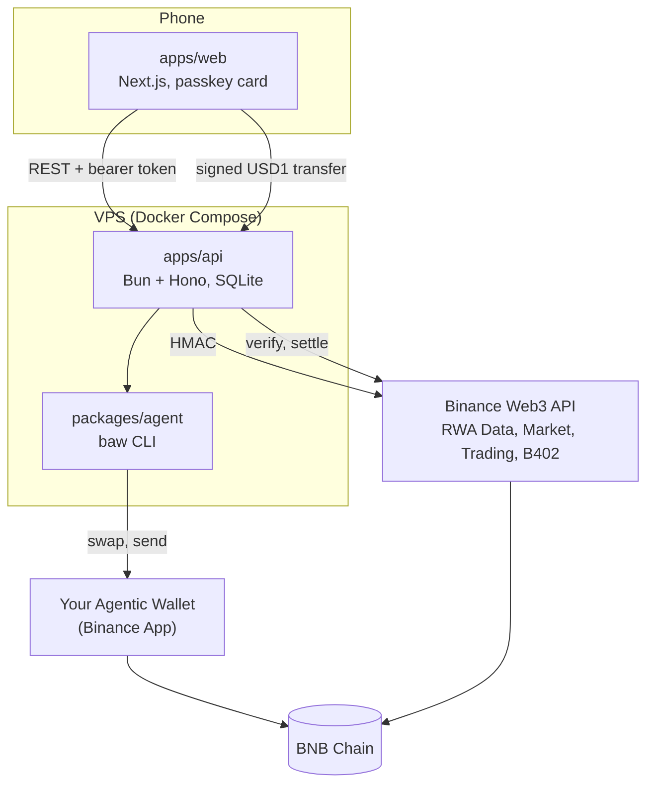

## Repository

| Path | What | Owner |
|---|---|---|
| `apps/web` | Cardholder app at app.tozzecard.xyz (Next.js 16, React 19) | Axel |
| `apps/landing` | Site at tozzecard.xyz | Axel |
| `apps/docs` | These docs (Mintlify) | Kiel, Axel |
| `apps/api` | Market hours, close reference, forecaster, refill and rebalance scheduler, decision log, cards, Didit, demo merchant (Bun + Hono, SQLite) | Kiel |
| `packages/agent` | Drives the Agentic Wallet through `baw`: quote, swap, send, rebalance | Fajar |
| `packages/binance` | Binance Web3 API client (HMAC signing) and EIP-3009 helpers | Kiel |

## API modules

| File | Does |
|---|---|
| `market.ts` | Polls Binance every minute; keeps the per-share close reference; computes the spread |
| `calendar.ts` | New York regular session, 9:30–16:00, minus 2026 holidays |
| `forecast.ts` | Weekday/weekend spending average over 28 days |
| `refill.ts` | Pure function: refill now, how much, which stock, and why |
| `scheduler.ts` | Runs the plan each tick; executes in live mode; daily rebalance; logs decisions |
| `card.ts` | Sign-in challenges, sessions, card face |
| `kyc.ts` | Didit sessions and the signed webhook |
| `strategy.ts` | Target weights and weekly spend |
| `merchant.ts` | Demo merchant on B402 |
| `openapi.ts` | The OpenAPI 3.1 spec behind the [API reference](https://api.tozzecard.xyz/docs) |

## A refill, end to end

1. `market.ts` polls prices and market status from the RWA Data API.
2. `scheduler.ts` reads the card's USD1 balance from the chain and the agent wallet's holdings.
3. `forecast.ts` and `refill.ts` decide; the decision is logged.
4. In live mode, `packages/agent` checks the session and Developer Mode, then `baw market-order swap` sells the stock (via USDT for Ondo) and `baw wallet send` sends USD1 to the card.
5. The transaction hashes are saved on the decision.

## Choices

- **No contracts of our own.** Custody, the send limit, swaps and gasless payments are all Binance's, BNB Chain's or the issuer's.
- **No smart account.** The card is a plain EOA; B402 makes it gasless.
- **One agent, one card.** `baw` is a CLI with one session per wallet and no HTTP API, so the hosted agent serves one card.
