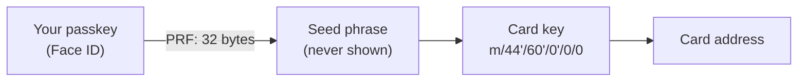

The card is a plain wallet on BNB Chain (an EOA), like the ones in MetaMask or your Binance Wallet. What's different is where its key comes from.

## Where the key comes from

1. Your passkey has a feature called **PRF**: asked the same question, it always gives the same 32 secret bytes, and only after Face ID.
2. Those bytes become a standard seed phrase (BIP-39), which is never shown or saved.
3. The seed gives the card key on the usual Ethereum path, `m/44'/60'/0'/0/0`, and the key gives the address.

This happens on your device every time you sign in, and the key lives only in memory while the app is open. Nothing is written to a server or to the browser, so there is nothing to steal from us.

The app uses [Mera](https://github.com/category-labs/mera) to talk to the passkey and `@scure/bip39` / `@scure/bip32` for the derivation.

## What follows from it

| | |
|---|---|
| **Same passkey, same card** | On any device where your passkey syncs. See [Use another device](/guides/other-devices) |
| **No seed phrase to write down** | Your passkey is the backup. Keep it synced |
| **No recovery yet** | Lose every copy of the passkey and the card can't be opened again |
| **Tied to the website** | A passkey belongs to `app.tozzecard.xyz`. A copy of the site on another address can't use it |

## Why it never needs BNB

The card never sends a transaction itself. To pay, it **signs** a USD1 transfer (EIP-3009 `transferWithAuthorization`) and hands it to the merchant. The merchant passes it to Binance's B402, which sends the transaction and pays the gas. USD1 supports this kind of signed transfer, so no approval step and no BNB are needed.

## The card face

After the [identity check](/guides/activate-card), the card gets a number, expiry (3 years), CVV and your name from your ID. The number is derived from the card address. It identifies the card in the app only; it is not a payment-network number.
