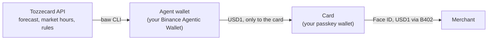

## The flow

<Steps>
  <Step title="Create the card">
    Open the app and confirm with Face ID. Your passkey makes the card's key on your device. No seed phrase, and we never see the key.
  </Step>
  <Step title="Activate it">
    An ID photo and a selfie with Didit. Once approved, the card gets its number and your name.
  </Step>
  <Step title="Connect the agent">
    Sign in to your Binance Agentic Wallet and add **only your card address** to its address book, in the Binance App.
  </Step>
  <Step title="Pick your stocks">
    Set a target split (for example 55% NVIDIA, 15% Microsoft) and roughly what you spend in a week.
  </Step>
  <Step title="Spend, and let the agent refill">
    Pay in USD1 with Face ID. The agent forecasts what you will spend until the next open and, before the close, sells a little of the stock that grew past its target and sends the dollars to your card.
  </Step>
</Steps>

## Who does what

| Piece | What it does |
|---|---|
| **Card** | A plain wallet whose key comes from your passkey. It only signs; Binance's B402 sends the payment and pays the gas, so the card holds 0 BNB |
| **Agent wallet** | Your Binance Agentic Wallet. Holds the stocks, swaps them to USD1, sends USD1 to the card |
| **Tozzecard API** | Watches New York market hours and prices, forecasts your spending, decides when to refill, and logs every decision with its reason |
| **Address book** | The guard. The Agentic Wallet refuses to send anywhere not in it, and only you can edit it in the Binance App |

## What Binance and BNB Chain provide

| Piece | Role |
|---|---|
| BNB Chain (BSC mainnet) | Where the stock tokens, USD1, swaps and payments live |
| Binance Agentic Wallet (`baw`) | The agent's wallet: swaps and sends; its address book limits where money goes |
| Binance Web3 API: RWA Data, Market, Trading | Market hours, prices and executable quotes |
| B402 | The card's payment rail. Binance submits the transaction and pays its gas |
| BNB | Gas for the agent wallet only |

<Card title="Why the timing matters" icon="arrow-right" href="/learn/weekend-prices" horizontal>
  What happens to token prices when New York is closed.
</Card>
